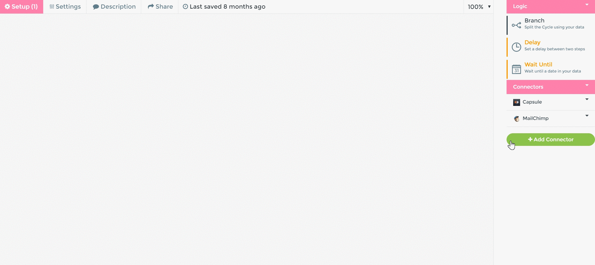
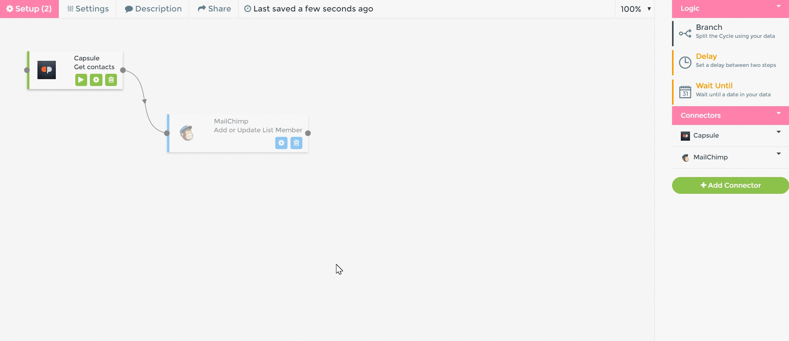

# Build a Cycle #

Once you have [installed connectors](./installing-connectors) for your apps, you can begin to connect and automate your apps.

### Add a trigger

A trigger is the first step in your cycle; the event that causes the process to start.

To add your trigger, click on the name of the app in the right sidebar. This will reveal different categories of step. Clicking on the name of a category will then reveal the steps that you can use.

There are two types of trigger:

*   Green: these are a “get” which will connect to the app on a timer to get data
*   Grey: these are “webhooks” which wait for data to be sent to them

Choose a trigger, then click-drag it onto the builder canvas to the right.

### Setup your trigger

Once you have added a trigger, click on its cog button in order to set it up.

Depending on the type of trigger you have used you will need to setup some of the following:

*   **Interval**: how often the trigger will run
*   **Mappings**: for example, a get trigger may allow you to be more specific about what you wish to get (_these contacts_, _this mailing list_, etc)
*   **Webhook URL**: you may need to paste this back into the app you’re connecting

### Add an action

With a trigger now setup, you need to add an action: the step that will be taken after the first step runs.

Action steps are blue and they may include some of the following:

*   Add contacts
*   Send a message
*   Create a task

Click-drag an action step onto the builder’s canvas, dropping it near your trigger step.

Next, click-drag the dot on the right side of the trigger and drop it onto the dot on the left side of your action. The steps should now be joined.

### Field mapping

With the two steps joined, you should now click the button on your action and perform the setup and field mapping.

The left most column contains the fields for current step you are setting up. In the right column, you can choose where this app’s field data comes from.

Any previous step’s fields are available to you. In addition, you can type values, look up values, or select default values provided by the app.

Fields marked with a tick are required and must be mapped.